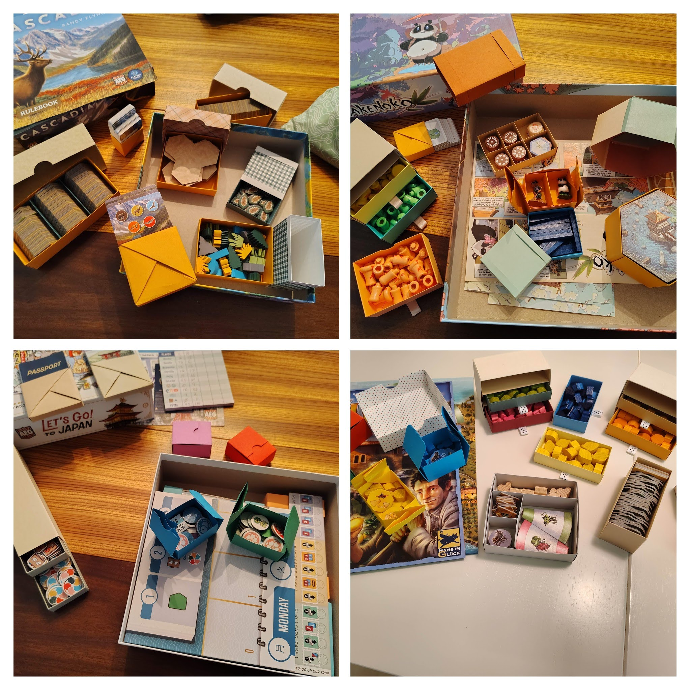

# Folded Board Game Organizers

## What Is This?
Many board games benefit from improved or upgraded storage of components. Popular techniques for creating better organizers include 3D printing, foamcore, or wood. Many companies or individuals sell inserts for popular games. If you're interested in a technique that is more affordable *and* a fun hobby, you can also create organizers by folding paper. I learned to do this from a series of YouTube [videos](#videos). These organizers are durable, (mostly) easy to make, require little up-front investment, and can be customized to the dimensions of your game components and box.

## What Do I Need?
First, there are some essential tools:
1. Paper
2. A paper cutter
3. Pencil
4. Ruler (calipers!?)
5. Calculator

Once you start making boxes, you may want to get some additional supplies:
- Scoring tool (mech pencil, etc)
- Bone folder (marker, etc)
- Sticky dots, tape, glue, ...
- Ribbon, other adornments (witch's brew deck holders with washi tape)

## Videos
This [YouTube Playlist](https://youtube.com/playlist?list=PLTq4tlqPnAwu9uZ0vgcznwH3IMslMwSMX&si=rLQZITLVdk6HeHI_) contains nine different videos, explaining how to create various kinds of boxes, dividers, and other organizational aids. They are an excellent resource for learning (or refreshing) any of the techniques.
