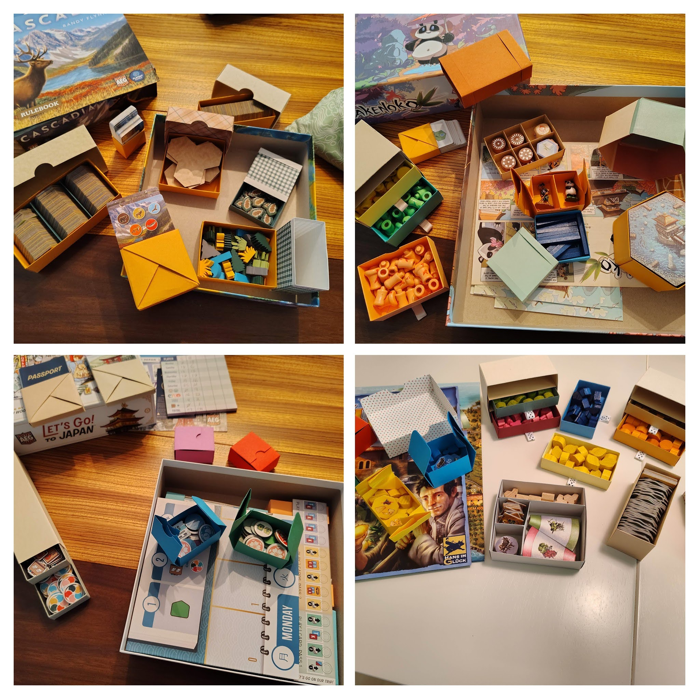

# Folded Board Game Organizers

## What Is This?
Many board games benefit from improved or upgraded storage of components. Popular techniques for creating better organizers include 3D printing, foamcore, or wood. Many companies or individuals sell inserts for popular games. If you're interested in a technique that is more affordable *and* a fun hobby, you can also create organizers by folding paper. I learned to do this from a series of YouTube **[videos](#videos)**. These organizers are durable, (mostly) easy to make, require little up-front investment, and can be customized to the dimensions of your game components and box.

The videos are really the first stop for learning what you're doing. Everything I'm putting here is supplemental tips, and recommendations about supplies. You will also learn that some aspects are more art than science - even with precise measurements, the folding process always introduces some slight variation. Learning to anticipate how certain types of boxes react to different papers, and which dimensions will inflate slightly is gained with experience. In general: Leave some slack, don't try to be **too** exact at the beginning. Also, you can always remake something that doesn't work out perfectly! (But if you bought some special paper, consider doing a practice box with something disposable).

## What Do I Need?
First, there are some essential tools:

- Paper

    You want paper with some weight to it (typically called cardstock), but not necessarily *too* heavy. However, different applications will work better with different weights. I use 65 lb. - 100 lb. paper for most things. I get all of my paper from either [The Scrap Exchange](https://www.scrapexchange.org/), or [Michael's](https://www.michaels.com/). Scrap Exchange is a local nonprofit in Durham, and you can get all kinds of weird paper for very cheap - but you're not always sure what's going to be there. Michael's is more expensive (wait for sales and coupons!), but you can get exactly what you need for a special project.

- Paper Cutter

    I use a simple cutter like [this one](https://a.co/d/gRy07fQ), but any similar paper trimmer/cutter will work. The [big kind](https://a.co/d/ghL0g1q) with a long blade should work fine, too. (Bonus: You're all set if there's a Jon Stewart alien invasion).

- Pencil for marking mesured lengths, drawing fold lines, etc.
- Ruler with **millimeters**. In theory you can use imperial units, but most of the fold designs involve doing math to determine paper size or where to fold. Do you want to compute $(3\frac{7}{8}+1\frac{11}{16})/\sqrt{2}$?

- Calculator to do that math I just mentioned. (Of course, this can be your phone).
- Scissors to make extra cuts in some cases. Certain designs can be done without any cuts, but some dividers require a few snips. The most commonly useful box design tends to work better with some cuts, as well. (The relevant video explains this).

Once you start making boxes, you may want to get some additional supplies:

- Something to press and crease folds. The "official" tool for this is called a [bone folder](https://a.co/d/7PZST9T), but you can use almost anything. I did many of my game boxes using an old highlighter.
- Something to score folds. For some designs, it's nice to get really sharp folds. Scoring (running a sharp tool along the paper to imprint it without cutting) makes folding much easier and produces nicer looking folds. In theory you can use a bone folder (see above), but I find the tip too dull to get millimeter-accurate scoring. I've used the metal tip from mandala [painting rods](https://www.michaels.com/product/mandala-dotting-tools-with-colorful-handles-by-craft-smart-6ct-10649080), but honestly - a mechanical pencil with the lead retracted, or the dull side of a butter knife can work just fine.
- Some kind of adhesive. Again - you can do most of the desgns without any adhesive, but certain folds and tucks may not stay as well as you'd like. I never use glue, just because I'm too impatient to wait for it to dry. Instead, I use [glue dots](https://www.michaels.com/product/glue-dots-craft-dots-roll-10090004) or - more often - [roll-on adhesive](https://www.michaels.com/product/tombow-mono-permanent-adhesive-10216739).
- Ribbon and other adornments. This only comes up if you're getting fancy and trying to make things cute. There are ways to make little drawers that go into a "cabinet", and putting loops of ribbon in provides a nice way to pull the drawers out. I've also used washi tape to decorate certain boxes.

## Videos
This [YouTube Playlist](https://youtube.com/playlist?list=PLTq4tlqPnAwu9uZ0vgcznwH3IMslMwSMX&si=rLQZITLVdk6HeHI_) contains nine different videos, explaining how to create various kinds of boxes, dividers, and other organizational aids. They are an excellent resource for learning (or refreshing) any of the techniques.
